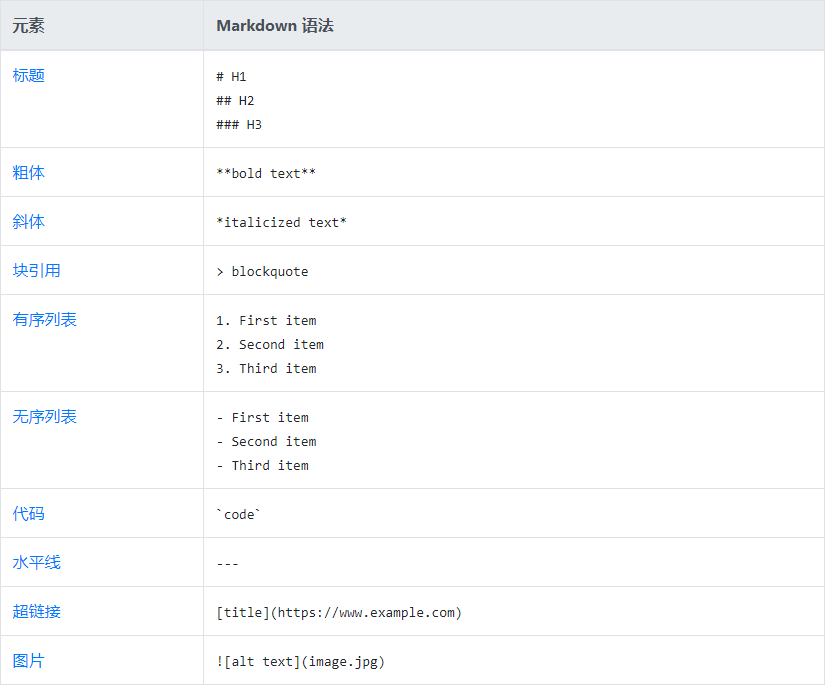
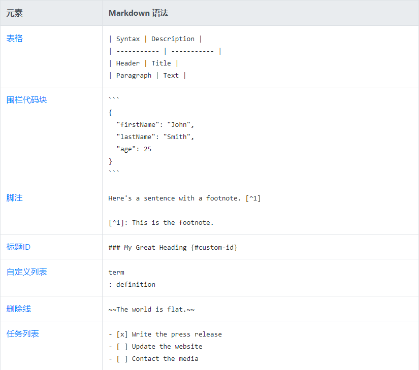

# Markdown备忘表

Markdown语法快速参考。

## 总览

该Markdown备忘单提供了所有Markdown语法元素的快速概述。它无法涵盖所有??的极端情况，因此，如果您需要有关这些元素中任何一个的更多信息，请参阅我们的参考指南以获取基本语法和扩展语法。

## 基本语法

这些是John Gruber原始设计文档中概述的元素。所有Markdown应用程序都支持这些元素。

## 扩展语法

这些元素通过添加其他功能来扩展基本语法。并非所有Markdown应用程序都支持这些元素。

